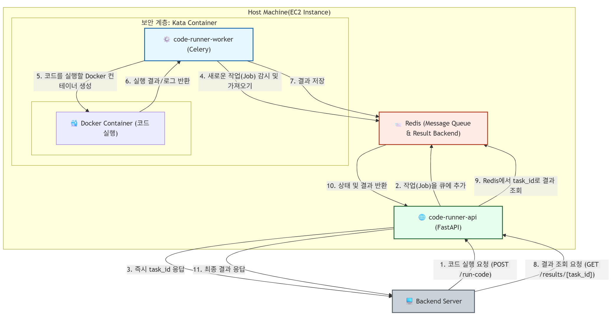

# Code Runner 서비스 (Job Queue Architecture)

## 개요

Code Runner는 사용자로부터 제출된 코드를 안정적이고 확장 가능한 방식으로 실행하기 위해 **Job Queue(작업 큐)** 아키텍처로 설계된 서비스입니다. FastAPI, Celery, Redis를 기반으로 하여 높은 동시성 처리 능력과 빠른 API 응답 속도를 제공합니다.

## 아키텍처

이 서비스는 역할에 따라 세 개의 주요 컴포넌트로 구성됩니다.

`[User] -> [code-runner-api] -> [redis] <- [code-runner-worker] -> [EC2 Instance] -> [Docker Container]`

1.  **API Server (`code-runner-api`)**: FastAPI로 구현된 API 서버입니다. 코드 실행 요청을 받아 즉시 처리하지 않고, 작업(Job)으로 만들어 Redis Queue에 넣은 후 작업 ID를 반환합니다. 매우 가볍고 빠르게 동작합니다.

2.  **Message Queue (`redis`)**: Celery의 메시지 브로커 역할을 하는 인메모리 데이터 저장소입니다. API 서버가 전달한 작업들을 대기열(Queue)에 저장하고, Worker가 가져갈 수 있도록 전달합니다.

3.  **Worker (`code-runner-worker`)**: Celery로 구현된 작업자입니다. Redis Queue를 지속적으로 감시하며, 새로운 작업이 들어오면 가져와서 원격 EC2 인스턴스에서 코드를 실행합니다. 실제 연산과 리소스 사용은 이 컴포넌트에서 발생합니다.

## 서비스 구성

`docker-compose.yml` 파일은 위 아키텍처를 다음과 같이 세 개의 서비스로 정의합니다.

-   **`code-runner-api`**: 사용자의 HTTP 요청을 처리하는 API 서버.
-   **`code-runner-worker`**: 실제 코드 실행을 담당하는 Celery 워커. 보안을 위해 Kata Container 위에서 동작하며, 동시에 50개의 작업을 처리하도록 설정되어 있습니다.
-   **`redis`**: API 서버와 워커를 연결하는 메시지 브로커.



## API 명세

### `POST /run-code`

코드 실행을 요청하고 작업 ID를 발급받습니다.

-   **요청 본문 (Request Body)**:
    ```json
    {
      "language": "python",
      "code": "print('Hello from Celery!')"
    }
    ```
    -   `language` (string, 필수): 프로그래밍 언어. (`python`, `javascript`, `java`, `cpp`, `c`)
    -   `code` (string, 필수): 실행할 소스 코드.

-   **성공 응답 (`200 OK`)**:
    요청이 성공적으로 큐에 추가되면, 해당 작업의 ID가 반환됩니다.
    ```json
    {
      "task_id": "a1b2c3d4-e5f6-7890-1234-567890abcdef"
    }
    ```

### `GET /results/{task_id}`

작업 ID를 사용하여 코드 실행 상태 및 결과를 조회합니다.

-   **요청 경로 (Path)**:
    -   `task_id` (string, 필수): `/run-code` 요청 시 반환받은 작업 ID.

-   **응답 (Response)**:
    -   **작업 진행 중:**
        ```json
        {
          "status": "PENDING",
          "result": null
        }
        ```
    -   **작업 완료:**
        ```json
        {
          "status": "SUCCESS",
          "result": {
            "output": "Hello from Celery!\n"
          }
        }
        ```
    -   **작업 실패:**
        ```json
        {
          "status": "FAILURE",
          "result": "...error message..."
        }
        ```

## 환경 변수

`.env.example` 파일을 복사하여 `.env` 파일을 생성하고, 다음 환경 변수를 설정해야 합니다.

- `AWS_REGION`: AWS 리전 (예: `ap-northeast-2`)
- `EC2_AMI_ID`: 코드 실행에 사용할 EC2 AMI ID
- `EC2_INSTANCE_TYPE`: EC2 인스턴스 유형 (예: `t2.micro`)
- `EC2_SECURITY_GROUP_ID`: EC2 인스턴스에 적용할 보안 그룹 ID
- `EC2_IAM_INSTANCE_PROFILE_ARN`: EC2 인스턴스에 적용할 IAM 인스턴스 프로파일 ARN
- `REDIS_URL`: Redis 서버 URL (예: `redis://redis:6379/0`)
- `REMOTE_EXECUTOR_PATH`: 원격 EC2 인스턴스에 있는 `remote_executor.py` 스크립트의 경로
- `IDLE_INSTANCE_WAIT_TIMEOUT`: 유휴 인스턴스를 기다리는 최대 시간 (초, 기본값: 120)
- `IDLE_INSTANCE_POLL_INTERVAL`: 유휴 인스턴스를 폴링하는 간격 (초, 기본값: 5)

## 보안

- **셸 주입 취약점**: `remote_executor.py`의 초기 버전에는 셸 주입 취약점이 있었으나, 코드를 환경 변수로 전달하고 `echo` 사용을 제거하여 패치되었습니다.
- **컨테이너 격리**: 사용자의 코드는 네트워크가 비활성화되고 리소스가 제한된 Docker 컨테이너 내에서 실행됩니다.
- **Kata Containers**: `code-runner-worker` 서비스는 추가적인 보안을 위해 Kata Containers 런타임을 사용하도록 구성할 수 있습니다. 이를 통해 컨테이너 탈출 공격을 방지하기 위한 하드웨어 수준의 격리를 제공합니다.


## 배포

1.  **인스턴스 준비**: `docker-compose.yml`에 설정된 리소스(`cpus: '16'`, `memory: 7G`)를 감당할 수 있는 고사양 인스턴스를 준비합니다.
2.  **Kata Container 설정 (선택 사항)**: 추가적인 보안이 필요한 경우, 호스트에 Docker와 Kata Container를 설치하고 Docker 데몬을 설정합니다.
3.  **환경 변수 설정**: 프로젝트 루트에 `.env` 파일을 생성하고 필요한 환경 변수를 설정합니다.
4.  **서비스 실행**: 프로젝트 최상위 디렉토리에서 아래 명령어를 실행합니다.
    ```bash
    docker-compose up -d --build
    ```